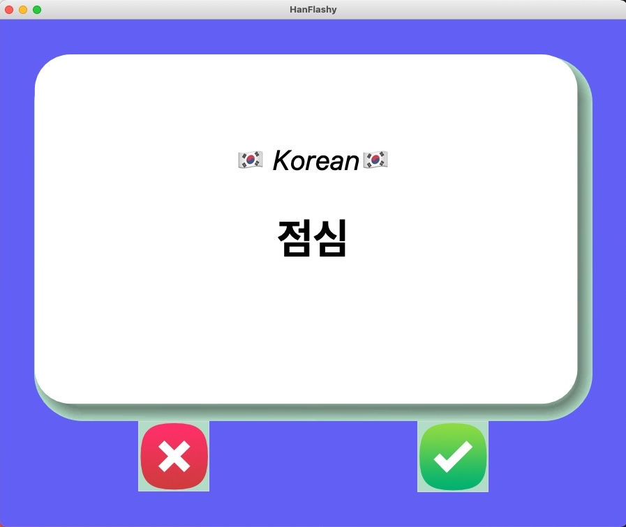

# HanFlashy

### Flash cards to test your Korean vocab

Korean words come from [Wiktionary:Frequency lists](https://en.wiktionary.org/wiki/Wiktionary:Frequency_lists)

My Korean is awful, so I used Google Translate. My apologies.

## Some screenshots

